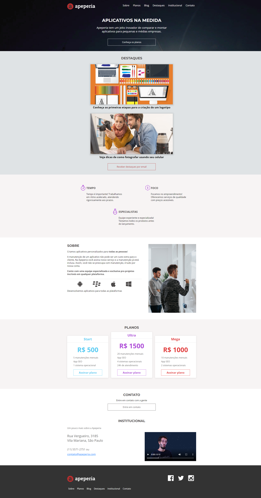
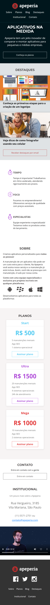

# <h1 align="center">Projeto Apeperia</h1>

 

<h2 align="center"> Imagem da página Desktop </h2>
 

 

<h2 align="center"> Imagem da página Mobile </h2>
 

 

<h2 align="center"> Descrição do Projeto </h2>
 
    Criação do site Apeperia, o qual possui a função comparar e montar aplicativos para pequenas e médias empresas.
     
     
    Projeto desenvolvido para demonstrar os conhecimentos adquiridos no curso "Layouts Responsivos: trabalhando com layouts mobile", presente no site na Alura.
 

<h2 align="center"> :hammer:  Ferramentas e Funcionalidades  :hammer: </h2>
 

 
          
<h2 align="center"> :notebook:  O que Aprendi  :notebook:</h2>

 - Melhorar a manutenção de códigos com variáveis CSS;
 - Escrever códigos que ajudam na acessibilidade;
 - Adaptação do site a diferentes layouts;

 
 
<h2 align="center"> :heart:  Contato  :heart:</h2>
 

regothardo@gmail.com
